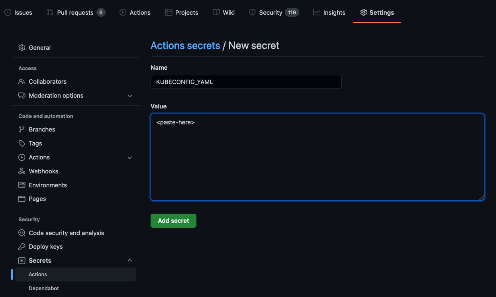

Admin Use
===

Welcome, Admin!
This document starts with getting a working environment running. Then explains what is running. And finally, covers options for customization.

[README.md](./README.md) is intended to capture all instructions for developers on the project. Update README.md as needed to reflect your custom instructions.

## Disclaimers

The emphasis of this project to get a simple, working example to be built upon to fit your organization's needs. As such:
- This document is not intended to cover every possible customization, nor teach the depths of any mentioned tools. The admin (you) will be expected to research and learn about third party tools as needed. 
- This documentation _will_ have large gaps and _will_ become outdated. 
- Familiarity with devops.pingidentity.com and helm.pingidentity.com is expected

This document separated by customizable areas:
- [Admin Use](#admin-use)
  - [Disclaimers](#disclaimers)
- [Get Running](#get-running)
  - [Prerequisites](#prerequisites)
  - [Github Secrets](#github-secrets)
  - [Server Profiles](#server-profiles)

# Get Running

First, start by getting the simple example working. 

## Prerequisites


- Choose a namespace you have full access to in the cluster and export it in your shell:
 
  ```
  export K8S_NAMESPACE=<ping-devops-user>
  ```

## Github Secrets

CI/CD tools typically can store secrets. Here are the secrets relevant to this project. Create these when first initializing the repo.

- KUBECONFIG_YAML - How the CICD job runner (ubuntu machine) will identify and authenticate to the kubernetes cluster. 


```
cat <<EOF | kubectl apply -f -
apiVersion: v1
kind: ServiceAccount
metadata:
  name: ping-devops-admin
  namespace: ${K8S_NAMESPACE}
---
apiVersion: v1
items:
- apiVersion: rbac.authorization.k8s.io/v1
  kind: Role
  metadata:
    name: namespace-admin
    namespace: ${K8S_NAMESPACE}
  rules:
  - apiGroups:
    - '*'
    resources:
    - '*'
    verbs:
    - '*'
kind: List
metadata:
  resourceVersion: ""
  selfLink: ""
---
apiVersion: rbac.authorization.k8s.io/v1
kind: RoleBinding
metadata:
  name: namespace-admin
roleRef:
  kind: Role
  name: namespace-admin
  apiGroup: rbac.authorization.k8s.io
subjects:
- kind: ServiceAccount
  name: ping-devops-admin
EOF
```

Creation of this Service Account automatically generates a secret (ping-devops-admin-token-<uid>) with a token that can be used for authentication.

```
kubectl get secret \
-o=jsonpath='{.items[?(@.metadata.annotations.kubernetes\.io\/service-account\.name=="ping-devops-admin")].data.token}' \
| base64 --decode
```

> Note: If this secret is deleted, the following kubeconfig will be invalidated

Copy your current `~/.kube/config file` and edit the copy to use the new service account

```
cp ~/.kube/config ~/.kube/ping-cicd
```

Manually edit to match Sample kubeconfig file: 

```
apiVersion: v1
clusters:
- cluster:
    certificate-authority-data: <base64-cert>
    server: <server-url
  name: <cluster-name
contexts:
- context:
    cluster: <cluster-name>
    namespace: <K8S_NAMESPACE>
    user: ping-devops-admin
  name: ping-cicd
current-context: ping-cicd
kind: Config
preferences: {}
users:
- name: ping-devops-admin
  user:
    token: <token-from-above>
```

Test for valid kubeconfig with:
```
export KUBECONFIG=~/.kube/ping-cicd
kubectl get pods
```

Add the kubeconfig as a secret in the Github Repo:

```
cat ~/.kube/ping-cicd | base64 | pbcopy
```



## Server Profiles

This repo will use the profiles directory for uploading config. To demo this repo, use the [baseline server-profile](https://github.com/pingidentity/pingidentity-server-profiles/tree/master/baseline).

```
cd ~/projects/devops
git clone https://github.com/pingidentity/pingidentity-server-profiles.git ~/projects/devops/pingidentity-server-profiles
cp -r ~/projects/devops/pingidentity-server-profiles/baseline/* ~/projects/devops/pingidentity-devops-reference-pipeline/profiles
```

To match product names on the helm chart, make some adjustments:

```
cd ~/projects/devops/pingidentity-devops-reference-pipeline/profiles
mv pingaccess pingaccess-engine
mv pingfederate pingfederate-engine
mkdir -p pingaccess-admin/instance pingfederate-admin/instance
mv pingaccess-engine/instance/data pingaccess-admin/instance/data
mv pingfederate-engine/instance/bulk-config pingfederate-admin/instance/bulk-config
mv pingdatagovernance pingauthorize
cp -r pingcentral/dev-unsecure/instance pingcentral
rm -rf CONTRIBUTING.md DISCLAIMER LICENSE docker-compose.yaml pingdataconsole-8.3 pingdatagovernance-8.1.0.0
cd -
```

> Note: The naming convention here is important. There should be a folder with the corresponding product-name from pingidentity/ping-devops helm chart for each product you wish to use. This naming structure will be used by the deploy script fo identifying if the product needs to be rolled.

Sample profiles folder structure after the above commands:

```
% tree -L 2
.
├── README.md
├── admin.md
├── helm
├── img
├── profiles
│   ├── pingaccess-admin
│   ├── pingaccess-engine
│   ├── pingauthorize
│   ├── pingcentral
│   ├── pingdataconsole
│   ├── pingdelegator
│   ├── pingdirectory
│   ├── pingdirectoryproxy
│   ├── pingfederate-admin
│   └── pingfederate-engine
└── scripts
```

PingFederate and PingAccess are special cases. In this pipeline, the admin console for each of these products will receive all files under <product>-admin and <product>-engine profiles. The engine for each of these products will receive only the <product>-engine files. This correlates to the recommended operating pattern on devops.pingidentity.com

