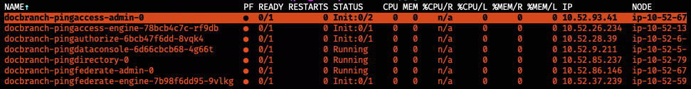
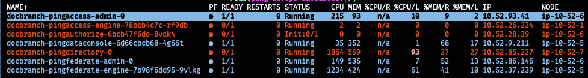
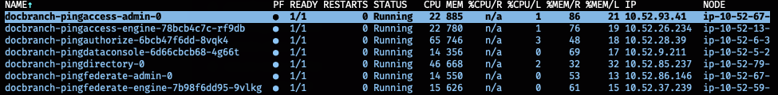
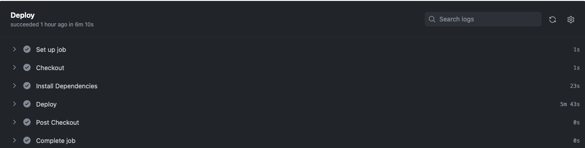
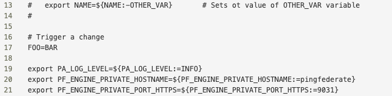
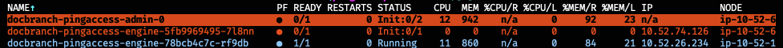
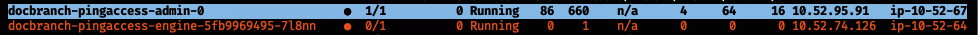
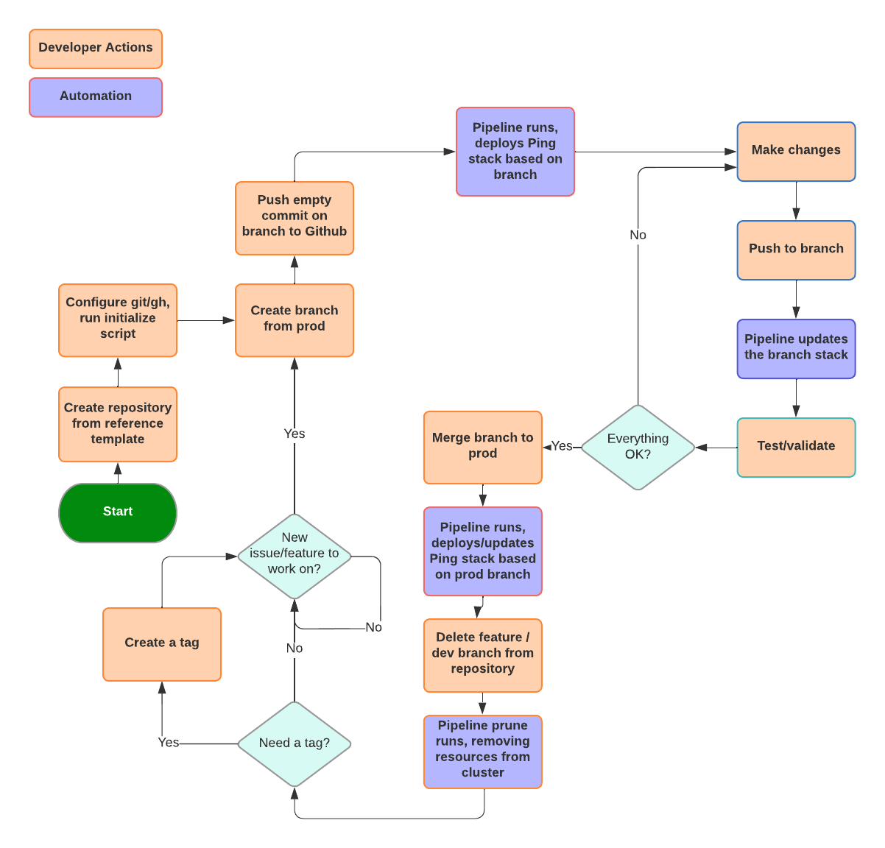

Reference CI/CD Template
===
> BEFORE YOU BEGIN: If you are new to CI/CD principles, it is recommended to work through the [CICD Demo](README_CICDDemo.md) in this repository first.  It is a simplified overview of the principles involved with this methodology.  It was written to run local in a Docker Desktop environment and should take 30 to 45 minutes to complete.

> DISCLAIMER: This is a template repository implementation of a **sample** CI/CD pipeline. This repository should not be considered production-ready and is intended for use as a demonstration only. It is intended only to provide an opportunity to experience Ping Identity Containerized Software in a CI/CD Model.

Welcome, Developer!

The demonstration flow is as follows:

- Launch an integrated Ping Software stack into a Kubernetes cluster
- Explore what is running to understand how things are deployed and configured
- Complete a simple feature flow where you can make a change and see the resulting activity
- Next steps, including customization options available from this demo.

**Table of Contents**
- [Reference CI/CD Template](#reference-cicd-template)
  - [General Information](#general-information)
  - [Prerequisites](#prerequisites)
    - [Recommended](#recommended)
  - [Before you start](#before-you-start)
  - [Launch an Environment](#launch-an-environment)
      - [Ping Identity's Baseline Server Profiles](#ping-identitys-baseline-server-profiles)
  - [Details of the default environment deployment process](#details-of-the-default-environment-deployment-process)
  - [Observe a change](#observe-a-change)
  - [Working on features](#working-on-features)
    - [Create a branch](#create-a-branch)
    - [Push to Prod](#push-to-prod)
      - [Use tags for final work](#use-tags-for-final-work)
      - [Development Lifecycle diagram](#development-lifecycle-diagram)
  - [Cleanup](#cleanup)
  - [Bring Your Own Profiles](#bring-your-own-profiles)
  - [Adjust Default Deployment](#adjust-default-deployment)
    - [Ingress](#ingress)
    - [Products](#products)

## General Information

**Development Model** - Interaction follows a development model similar to [Github Flow](https://docs.github.com/en/get-started/quickstart/github-flow) or trunk-based.

**Deployment architecture** - A Single Region implementation based on guidelines from [devops.pingidentity.com](devops.pingidentity.com).

**Default Branch** - prod

**Variables**

Files in the `helm` and `manifest` directories have the .subst suffix. This naming convention supports the files housing shell variables `${FOO}`. These variables will be computed to hardcoded values before deploying. Any variable in a .subst file should have a default value set in `scripts/lib.sh`

**Reading Comments** - Comments are structured as Markdown headers. Multi-line comments are indented. For readability, comments are not repeated with repeated code. In the YAML files, comment indentation matches relevant code:

```shell
# Top Level Comment
## Sub-Comment ...
##   ... rest of Sub-Comment
### Sub-Sub-Comment
```
**Gitignore**
Non .subst file counterparts are tracked in .gitignore to prevent accidental commits from local testing being published.

**Pipeline scripts**
In this repository under the **.github** folder are two pipeline YAML files:
- _deploy.yaml_
  -  This pipeline deploys a new Ping application stack whenever a push is made against any branch.
  -  It uses the helm charts provided by Ping to run **helm upgrade --install** to deploy the application.
  -  The stack will have the branch name prepended to the components for easy identification.
- _prune.yaml_ 
  - Similar to deploy.yaml, this pipeline will remove a Ping stack deployment when the corresponding branch is removed from the repository by running a **helm uninstall** call.  It also removes the underlying PVC and PV.


## Prerequisites

- Github account
- Publicly accessible Kubernetes cluster - the cluster must be _publicly accessible_ to use free [Github Actions Hosted Runners](https://docs.github.com/en/actions/using-github-hosted-runners/about-github-hosted-runners#about-github-hosted-runners). If you cannot use a publicly accessible cluster, see [Self-hosted Runners](https://docs.github.com/en/actions/hosting-your-own-runners/about-self-hosted-runners)
  <!-- TODO - in addition to self-hosted, a user could run all pipelines locally after pushing changes. -->
- [pingctl](https://devops.pingidentity.com/get-started/pingctlUtil/) configured or the PING_IDENTITY_DEVOPS_USER/KEY values exported in your shell environment
- [kubectl](https://kubernetes.io/docs/tasks/tools/)
- [git](https://git-scm.com/book/en/v2/Getting-Started-Installing-Git)
- [gh](https://cli.github.com/) the Github CLI utility
- Understanding of [Helm](https://helm.sh/docs/intro/quickstart/) and consuming Helm Charts
### Recommended
- [k9s](https://k9scli.io/)

## Before you start
If you have never used the **gh** utility, you will need to configure it for your repository. Run the command **gh auth login** and follow the prompts.  You will need an access token for your Github account as instructed:
```
gh auth login

? What account do you want to log into? GitHub.com
? You're already logged into github.com. Do you want to re-authenticate? Yes
? What is your preferred protocol for Git operations? HTTPS
? Authenticate Git with your GitHub credentials? Yes
? How would you like to authenticate GitHub CLI? Paste an authentication token
Tip: you can generate a Personal Access Token here https://github.com/settings/tokens
The minimum required scopes are 'repo', 'read:org', 'workflow'.
? Paste your authentication token: ****************************************
- gh config set -h github.com git_protocol https
✓ Configured git protocol
✓ Logged in as <User>
```
## Launch an Environment
Create a repository in your Github account from this template:
- Click **Use This Template** at the top of this page to create a new repository based on these contents in your account.

- Using git, clone the new repository to your local system

> The initial clone will launch a 'deploy' action in Github that will fail.  This failure is expected at this point.  The initial creation of the repository is considered a **push** event and further configuration is needed for the pipeline to process properly.

If you have not set your git.username and git.email values globally to match your Github credentials, set them for the local copy (run from the directory into which you have cloned):
```
git config user.email "you@example.com"
git config user.name "Your Name"
```
#### Ping Identity's Baseline Server Profiles
<!-- TODO CLEAN THIS UP-->
[Ping Identity's Baseline Server Profiles](https://github.com/pingidentity/pingidentity-server-profiles/tree/master/baseline) are maintained for demo and testing purposes. Eventually you will want to [bring your own profiles](#bring-your-own-profiles)

Start by deploying with the [baseline server-profile](https://github.com/pingidentity/pingidentity-server-profiles/tree/master/baseline) to get an environment running. Later in this guide, modifications from default will be discussed.

First, initialize your environment.  The following script will prepare your local and remote repositories. 

```
./scripts/initialize.sh
```
> As with the initial clone, there will be a push to your repository that will run a pipeline that fails at this time. This failure is also expected.

Next, deploy an environment.  To do so, create and push a new branch from a terminal or using the GitHub web console:

```
git checkout -b mydemo
git push --set-upstream origin mydemo 
```

As the code is deployed, you can observe the pipeline actions in the GitHub Actions logs. Select the **Actions** tab in your repository and you can see the pipeline running. In addition, you can use **kubectl** to observe the pods and other objects being created and starting in your Kubernetes namespace.  The **k9s** utility referenced above is ideal for watching real-time activity in a cluster.

These example screenshots show the status of the pods when provisioning against a branch named **docbranch** in the k9s application:
- Initial



- Progressing


- Finished



## Details of the default environment deployment process

At the conclusion of the above steps, you should see something similar to this example in the Github Actions for your repository:


So, what just happened?

The _initialize.sh_ script prepared your local and remote repositories for use. Server profiles are used to deploy configuration to products. The pipeline uses the profiles directory for storing config.

1. Profiles:
    1. The script cloned the Ping Identity Server Profiles baseline from https://github.com/pingidentity/pingidentity-server-profiles.git
    2. It copied the baseline files and folders to a `profiles` folder in your repository.
    3. It renamed folders in `profiles` to match the product names as found in the pingidentity/ping-devops helm chart.
2. With the renaming complete, it committed and pushed the profiles into the **_prod_** branch of your repository.
3. As part of the processing, the script uses the **gh** cli utility to create Action secrets for your repository. These secrets are necessary for the pipeline to work, which is why it fails on the initial clone and the first push from the initialize script:
   -  KUBECONFIG_YAML - the Kubernetes configuration for connecting to your cluster
   -  PING_IDENTITY_DEVOPS_USER_BASE64 - your Ping DevOps user in base64 encoding
   -  PING_IDENTITY_DEVOPS_KEY_BASE64 - your Ping DevOps key in base64 encoding
4. It also created a SHA sum of each of the Ping product directories in the `profiles` folder.  As you make changes to anything in these directories, the SHA will change, and this change will inform the pipeline that the product in question has changes and needs updating, which you may see referred to as 'rolling' the product in the scripts.

When you created a branch and pushed it to Github, the fact that the branch is NOT prod triggered the pipeline to run the helm commands for deployment, and that is when you saw the activity in the cluster with the creation of pods, services, configmaps, PVCs and so on.

## Observe a change
To see how Configuration-as-Code operates, you will make a simple change to one of the products and observe what happens in your cluster. To keep the demonstration simple and avoid the need to know details about the product in question, you will add an environment variable (that will be unused) to a configuration to trigger a change to that product in the cluster.

Modify the **/profiles/pingaccess-engine/env_vars** file, inserting an environment variable. For example, here lines 16 and 17 were added:


Add, commit and push your changes:
```
git add profiles/pingaccess-engine/env_vars
git commit -m"triggering change"
git push
```
The pipeline will run again.  As there was a change in the PingAccess configuration, and only this product, you will see the pods for the Admin and Engine cycling in the environment:


Later:


This process will run to completion until the replacement set of pods is in place with the new configuration (in our case, an extra, unused environment variable).

## Working on features

You can use the pipelines to work on features or testing.

### Create a branch
As we did in the previous section, **create a branch** off the default branch. The new branch will kickoff and deploy an up-to-date, isolated environment in which to build a new feature.

**Follow ingress URLs** - After the environment has deployed, features are developed through admin UIs, command line utilities, or api calls. Ingress URLs can be found with: 

```
kubectl get ingress -n <namespace>
```
**Thoroughly test** your new feature in your local environment. 

**Run generate-profile script** When you are ready to bring code back for a commit and pull request, run the `generate-profile` script. It uses your local git branch to identify which environment from which to build a profile.
### Push to Prod

When you are finished, you can merge your branch into **prod**.  Doing so will launch a new stack if one does not already exist for prod. If prod has already been deployed, it will be updated.  This deployment is your production environment, and you can create branches as needed to do more work, merging your changes back into **prod** when you are done.

#### Use tags for final work
While working, merge to your development branch as frequently as needed.  When you are ready to publish a change, tag the branch. Pushing tags makes tracing the history easier and provides room for rollback.
Note that creating a tag does not deploy anything into the cluster, but tags are a great way to mark a point in history as a point to which to roll back as necessary.

#### Development Lifecycle diagram

## Cleanup

When you are finished, you can remove the deployed components from the environment by deleting the branch from your repository.  Doing so will trigger the **_DeleteEnv_** pipeline which removes all resources from the cluster.

If you delete the repository, deleting **prod** requires a manual process first.

TODO: Samir notes here

## Bring Your Own Profiles

<!-- TODO -->


## Adjust Default Deployment

> Note: The defaults for the pipeline and reference profiles are aligned to Ping Employee's Kubernetes clusters.  If you are using one of these environments, no adjustments are necessary. 


The default deployment will deploy a number of software products with simple configurations and [ingresses](https://kubernetes.io/docs/concepts/services-networking/ingress/). Ingresses rely on the kubernetes cluster having an [ingress controller](https://kubernetes.io/docs/concepts/services-networking/ingress-controllers/) deployed. 


### Ingress

The default setup on [values.yaml.subst] will work for an nginx ingress controller with class "nginx-public". Update `global.ingress` on values.yaml to match your environment.

### Products

If you want to remove any product from your stack, change `<product>.enabled` to false. Over time, as you become more comfortable with the repository you can remove these pieces from the code entirely.

Example for turning off pingdataconsole:

```
pingdataconsole:
  enabled: false
  envs:
    SERVER_PROFILE_PATH: profiles/pingdataconsole
    PDC_PROFILE_SHA: "${PINGDATACONSOLE_SHA}"
```

