Simple CICD Demo
===

**Table of Contents**
- [Simple CICD Demo](#simple-cicd-demo)
- [Purpose](#purpose)
  - [Overview](#overview)
  - [Demo description](#demo-description)
  - [Applications used in this demo:](#applications-used-in-this-demo)
  - [Demonstration flow](#demonstration-flow)
  - [Differences from production environments](#differences-from-production-environments)
  - [Prerequisites](#prerequisites)
  - [Before you begin](#before-you-begin)
  - [Install, configure and populate the demo Git repository](#install-configure-and-populate-the-demo-git-repository)
    - [Namespace](#namespace)
    - [Deploy the application code repository](#deploy-the-application-code-repository)
    - [Create a repository user](#create-a-repository-user)
    - [Create a repository](#create-a-repository)
    - [Repository files](#repository-files)
    - [Populate the repository](#populate-the-repository)
  - [Jenkins](#jenkins)
    - [Jenkins files](#jenkins-files)
    - [Jenkins image](#jenkins-image)
    - [Create the Jenkins image and deploy Jenkins](#create-the-jenkins-image-and-deploy-jenkins)
    - [Configure Jenkins](#configure-jenkins)
      - [Define the Job](#define-the-job)
  - [Run the pipeline manually](#run-the-pipeline-manually)
    - [View the application](#view-the-application)
    - [Make changes to the application](#make-changes-to-the-application)
  - [Automate the process](#automate-the-process)
  - [Summary](#summary)
    - [Tearing down the demo environment](#tearing-down-the-demo-environment)
  - [Next steps](#next-steps)

# Purpose
This document provides step-by-step instructions on setting up a self-contained Continuous Integration / Continuous Delivery (CICD) pipeline.  After pulling images from Docker Hub and retrieving the Helm chart for the GIT repository, everything will operate exclusively on your local laptop with no external connectivity required.

By working through the demo, you will gain a better understanding of the principles around CICD, as well as having the opportunity to run a pipeline yourself and observe the steps involved.

>**Note**: This demo should take less than an hour to complete.

## Overview
CICD is a methodology whereby an application is automatically updated in an environment with each commit of new code.  To achieve this goal, several things need to be in place:
- Automation around testing and deployment
- A robust and trusted testing suite with gating to ensure the code is robust and operational before it is deployed
- A microservice architecture is best, ensuring that the changes made only affect a small portion of the entire application suite

Even if your organization is not ready for a fully automated delivery, a partial solution can be achieved, known as Continuous Integration / Continuous Deployment (unfortunately, the two methodologies have the same acronym).  With Continuous Deployment, after the code processes through the pipeline and all tests are passed, the pipeline ends with a final deployable artifact (a binary, a JAR package, Docker container, or similar) that could be deployed automatically.  However, with this model, the final artifact is reviewed manually and the deployment is performed manually as well.  This methodology is useful when an organization is not mature in their testing, or if there are other factors that preclude automatically updating the application for any reason.

You have probably seen an image similar to the following that outlines the overall process:

- Plan changes to be made
- Modify or create the code
- Build or compile the application or create the Docker image or artifact
- Run a robust testing suite
- Release the artifact, typically to a Git repository or Docker registry
- Deploy the new artifact into the environment
- Run the application
- Monitor the application and plan for improvements or fixes (returning you to the beginning of the process)

## Demo description
In this demo, you will deploy an HTTP application (actually, a static HTML page) to Kubernetes, and the application will update with each modification to your "code".  The code in this case is the HTML text - making simple text changes will allow you to focus on the overall process and not on the mechanics and syntax of writing application code.  As you modify the HTML and commit the changes to the repository, the application will go through a Jenkins pipeline that runs the build/test/deploy process you would see in a full CICD environment.  In approximately one to two minutes, you will be able to observe your updated code running in the cluster.

The setup for this demonstration is not fully automated.  Studies show that actively engaging in learning improves understanding and retention of concepts.  In order to gain insight into what is happening, you will deploy a Git-compatible environment and create the repository for housing the code and the pipeline.  In addition, you will build a custom Jenkins image with required plugins pre-installed and configure it to access the repository.  All of the code for creating everything you need is in this guide, and you can copy/paste to save typing.

>You are encouraged to explore the code in the files to improve your understanding of what actions are performed.  You should try to avoid simply doing a copy and paste operation over and over again to "get through" the demo.

## Applications used in this demo:

- [Gitea](https://gitea.io/en-us/) - an open source, lightweight GIT application that will be the repository for the application, the Dockerfile for building updated images, and the Jenkins pipeline
- [Jenkins](https://www.jenkins.io/) - the open source CI/CD tool
- [Python](https://www.python.org/) - the HTTP server included with Python will be used to host the HTML page, avoiding the need to dig into configuration files for any particular HTTP server such as Apache or Nginx

One advantage of performing this demo locally is that after the pipeline has processed successfully at least one time, it becomes self-contained.  This result means that you can run the demo anytime you like from your laptop without requiring an internet connection.  The author of this guide has used a setup similar to this one to demonstrate CICD principles to a fellow passenger on an airplane several times.

## Demonstration flow
After you have everything set up, the flow for this demo will look like this:
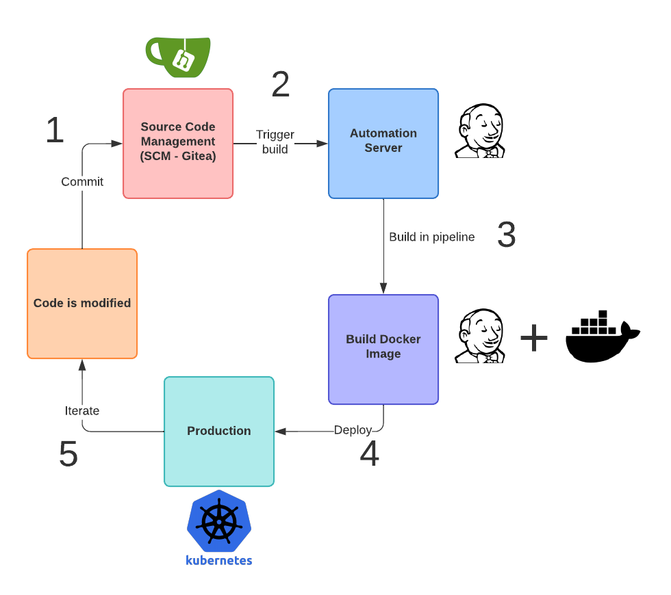
- Modified code is committed to Gitea
- Via a schedule, Jenkins will detect new code is present and checkout the pipeline and code
- Jenkins runs the pipeline, building the Docker image with the updated code
- Jenkins finishes the pipeline by deploying the new code to Kubernetes
- You can iterate with further changes to the code

## Differences from production environments
As a demonstration, some simplifications were made in order to focus on the flow and process more than the tooling.
- There are no tests being performed on the artifacts prior to deployment - these are simulated in the pipeline with a 20 second delay.
- With no testing, there is not a testing/staging environment as you would also typically find in production.
- Jenkins is serving as the CI tool building the Docker images as well as the CD component, deploying the updated code as part of the flow.  In many production environments, these actions are handled by separate tools that provide robust monitoring and notification services.
- The Jenkins master container is being used for building and deploying the code.  In production Jenkins environments, agents are used for these activities.
- Jenkins is configured to poll the repository for changes.  Production environments are generally set to run the pipelines through a webhook or other method to inform the CI system that a new code change has been made.
  - The Gitea Jenkins plugin has a requirement to use https for webhooks that would fire the pipeline. Configuring TLS unnecessarily complicates the setup of this demonstration so polling is used.
- With Docker images, an image registry or repository exists and the pipeline will push the images to this repository to make them available to other environments.  In this demonstration, the images are available locally, so no registry is necessary.

## Prerequisites
This guide was written using Docker Desktop on the Mac platform, but it can be adapted for other Kubernetes environments.

You will need:
- A basic understanding of [Kubernetes](https://kubernetes.io/) concepts, such as Deployments, Services, and familiarity with applying definition files to a Kubernetes cluster to create and modify objects
- The [git](https://github.com/git-guides/install-git) cli installed
- The [Helm](https://helm.sh/docs/intro/install/) application for deploying the Gitea application
- The [kubectl](https://kubernetes.io/docs/tasks/tools/) utility for working with Kubernetes (installed by default with Docker Desktop)
- Basic [Docker](https://www.docker.com/) experience
- [Docker Desktop](https://www.docker.com/products/docker-desktop/) with Kubernetes enabled, or access to a Kubernetes cluster (**Docker Desktop 4.6.1** was used for this document)
  - Enable Kubernetes if you have not already done so.  Navigate to the preferences panel of the Docker desktop application:
  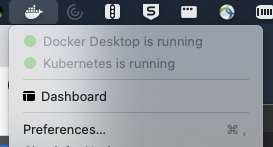
  - Select Kubernetes and select the checkbox Enable Kubernetes. Restart Docker to initialize Kubernetes as prompted:
  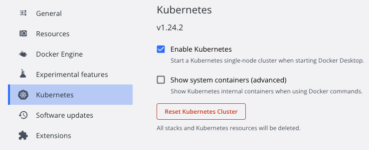
- Recommended, but not required, is the [k9s](https://k9scli.io/topics/install/) utility that allows you to see Kubernetes objects in a terminal UI.  For this guide, you will be given the `kubectl` commands to view objects, but with k9s you can do so more readily.

>**Note**: If you have configured your kubectl for other clusters, you can set your context to use the local Docker Desktop kubernetes with
 **`kubectl config use-context docker-desktop`**

## Before you begin
All of the files necessary for this demonstration are in the **cicdDemoFiles** directory of this repository.  However, you have to initialize git in one of the subdirectories.  To simplify navigation while working through the demo, copy the contents of this folder to a working directory and run the rest of the demo from that location.  For example:
```
mkdir ${HOME}/cicd
cp -r cicdDemoFiles* ${HOME}/cicd
cd ${HOME}/cicd
```
## Install, configure and populate the demo Git repository
### Namespace
Create the namespace and configure the context for kubectl commands:

```
### Create the namespace
kubectl create ns cicd

### Switch your kubectl context to use the new namespace by default
kubectl config set-context --current --namespace=cicd

### Confirm the namespace
### This should return "cicd"
kubectl config view --minify --output 'jsonpath={..namespace}'; echo
```

### Deploy the application code repository
Installation of the Gitea application is handled from the project's provided helm chart.
```
### Add the Gitea chart repository & deploy
helm repo add gitea-charts https://dl.gitea.io/charts/ 
helm install gitea gitea-charts/gitea
```

It will take about a minute for Gitea to initialize.  The `init` container will fail the first couple of times as it requires the database to be running.  The Docker images for gitea, postgres and memcached have to be pulled before the applications can start, extending the time until they are available.  You can check the status of the pods to ensure the application has started successfully:
```
### List pods
kubectl get pods

### Expected output when Gitea is running 
NAME                              READY   STATUS    RESTARTS   AGE
gitea-0                           1/1     Running   0          47s
gitea-memcached-9f7986c9c-bx8w9   1/1     Running   0          47s
gitea-postgresql-0                1/1     Running   0          47s
```
Confirm the Gitea service is listening on port 3000. The **gitea-http** service is the one that is used for browser access:
```
### List the services
kubectl get services

### Expected output - the gitea-http service is used for the UI
NAME                        TYPE        CLUSTER-IP       EXTERNAL-IP   PORT(S)           AGE 
gitea-http                  ClusterIP   None             <none>        3000/TCP         68s
gitea-memcached             ClusterIP   10.110.174.213   <none>        11211/TCP        68s
gitea-postgresql            ClusterIP   10.96.100.15     <none>        5432/TCP         68s
gitea-postgresql-headless   ClusterIP   None             <none>        5432/TCP         68s
gitea-ssh                   ClusterIP   None             <none>        22/TCP           68s
```
Create a port-forward to access the Gitea UI. ClusterIP services are not available outside of the cluster, so you have to forward a port to them:
- `kubectl port-forward svc/gitea-http 32220:3000`

>**Note**: The port forward will block the terminal - you will have to open another terminal session to continue running commands.

Open a browser window and enter the URL: http://localhost:32220 to access the Gitea interface.

>Some browsers will not load the page without encryption (i.e., https instead of http).  Firefox and Chrome generally let you proceed even without the TLS encryption. There is no traffic leaving your local system in this demo, so there is no security risk with unencrypted traffic.

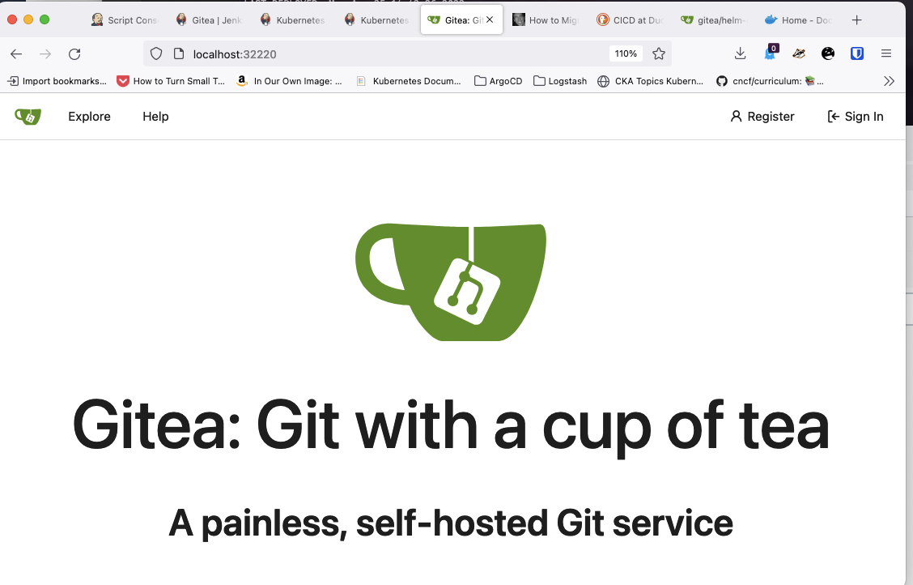

### Create a repository user
Jenkins has to be able to access Gitea 'remotely' through the service, so a username/password is needed.

In the Gitea interface, click **Register** to create a user:

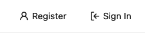

Provide the values and click **Register Account**. For this guide, the password was set to **_password_** but you may use any password:

- Username: **superapp**
- Email address: **superapp@democompany.com**
- Password / confirmation: **password**
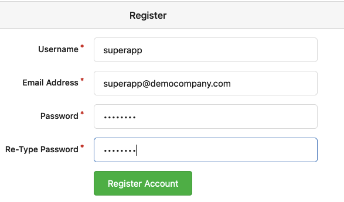

You are logged in as the superapp user when successful.

### Create a repository
Click the **+** sign in the repository list to create a new repository:
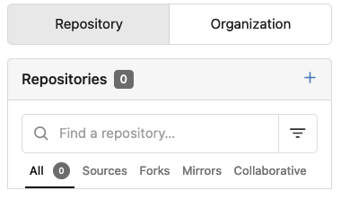

Provide the repository name as **superapp**, and leave all other options as default.  At the bottom of the page, click **Create Repository**. An empty repository is created:
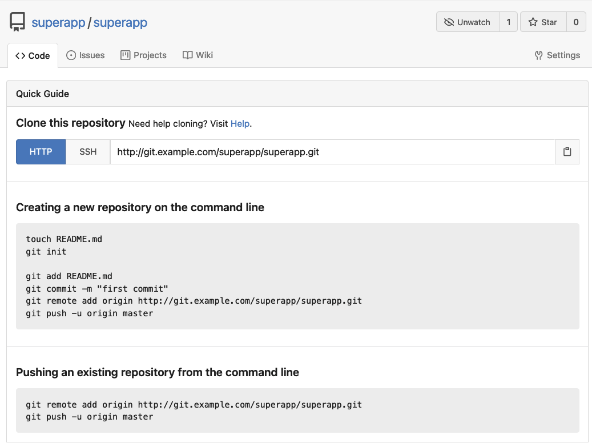

### Repository files
The Gitea repository will have 4 files.  They are linked here, found in the **cicdDemoFiles** directory in this repository:
- **[index.html](cicdDemoFiles/cicdDemo/index.html)**: This file contains the 'application code' that will be modified
- **[Dockerfile](cicdDemoFiles/cicdDemo/Dockerfile)**: Used for building the Docker image with the code baked in
- **[superapp.yaml](cicdDemoFiles/cicdDemo/superapp.yaml)**: Kubernetes YAML file deploying/updating the application
- **[Jenkinsfile](cicdDemoFiles/cicdDemo/Jenkinsfile)**: This file contains the pipeline script for automating the build/test/release process.  Jenkins will consume this file as the pipeline to be used when it clones the repository later.

The **index.html** file (the code) is a simple HTML page:
```
<html> 
<head> 
<title> CICD Demo </title>
</head>
<body bgcolor="white" text="blue">

<h1> Super Application </h1>

This application is AWESOME!!!

</body>
</html>
```

The **Dockerfile** for the demo application uses the `http.server` module included with Python to host the static **index.html** file.  The index file is baked into the image by the COPY directive, and the container will listen on port 8080:
```
FROM python:alpine3.15

COPY index.html /var/html/
WORKDIR /var/html
EXPOSE 8080
ENTRYPOINT ["python","-m","http.server","8080"]
```

The application deployment is handled through a Kubernetes YAML file that creates/updates the service and the application.  The service exposes the application on port 32222 as a NodePort, enabling you to access it in your browser at http://localhost:32222.  The **_REPLACEMEBUILDNUMBER_** string is replaced by the new image name every time the pipeline runs, triggering Kubernetes to update the deployment when applied:
```
apiVersion: v1
kind: Service
metadata:
  name: superapp-nodeport
  namespace: cicd
spec:
  type: NodePort
  ports:
  - port: 8080
    targetPort: 8080
    nodePort: 32222
  selector:
    app: superapp

---

apiVersion: apps/v1
kind: Deployment
metadata:
  name: superapp
  namespace: cicd
spec:
  replicas: 1
  selector:
    matchLabels:
      app: superapp
  template:
    metadata:
      labels:
        app: superapp
    spec:
      containers:
      - name: superapp-app-container
        image: superapp:1.REPLACEMEBUILDNUMBER
        ports:
        - containerPort: 8080
```

Jenkins will pull everything from the repository, including the pipeline.  The **Jenkinsfile** in the repository defines a declarative pipeline that takes the code from the repository, simulates a testing process, builds a new Docker image, and finally deploys the updated application to the Kubernetes environment using the new image. The image tag is derived from the **$BUILD_NUMBER** variable (the run number of the Jenkins job; for example, when the pipeline is ran the eighth time, the image will be tagged as version **1.8**).

>**Reminder**: This demo uses the Jenkins master container to run the pipeline rather than an agent.
```
pipeline {
  agent any
  stages {
    stage('Pipeline Started') {
      steps {
        echo "Received webhook from Git" 
      }
    }
    stage('Simulated Testing') {
     steps {
       echo "############## confirming environment ##############"
       sh "kubectl get pods"
       sh "docker info"
       echo "############## Simulated testing (duration: 20 seconds) ##############" 
       sleep 20
       }
     }
    stage('Docker Build') {
      steps {
        echo "############## building new Docker image ##############" 
        sh "docker image build -t superapp ."
        sh "docker image tag superapp:latest superapp:1.${BUILD_NUMBER}"
        sleep 5
        }
      }
    stage('Update Deployment') {
      steps {          
        echo "############## Confirming new image is on the local host ##############"
        sh "docker image ls | grep superapp"
        echo "############## Deploying new version of SuperApp ##############"
        sh "sed -i 's/REPLACEMEBUILDNUMBER/${BUILD_NUMBER}/g' superapp.yaml"
        sh "kubectl apply -f superapp.yaml"
        }
      }      
    }
    post {
      always {
         cleanWs()
      }
   }
}
```

### Populate the repository
Navigate to the directory in which you copied the demo files (**${HOME}/cicd** in the example above)

Initialize the directory it as a git repository.  Configure access to the Gitea repository and push the files.
```
### Navigate to the directory you placed the files (example here uses the directory created above)
cd ${HOME}/cicd/cicdDemo

### Confirm files
ls -l
total 32
-rw-r--r--  1 davidross  staff   130 Apr 26 10:35 Dockerfile
-rw-r--r--  1 davidross  staff  1161 Apr 27 08:31 Jenkinsfile
-rw-r--r--  1 davidross  staff   166 Apr 26 10:35 index.html
-rw-r--r--  1 davidross  staff   579 Apr 27 09:50 superapp.yaml

### Initialize git then add, commit, and push the files into the repository 
git init
git config user.email superapp@democompany.com
git config user.name "superapp"
git add *
git commit -m "first commit"
git remote add origin http://localhost:32220/superapp/superapp.git
git push -u origin master
```

Refresh the Gitea browser page to see the files in the repository:


>At this point, console access to the Gitea repository is no longer needed. If you no longer want to use the console, stop the port-forward in the terminal window running the forward by pressing **Ctrl+C** to cancel the process.

## Jenkins
Now that the code is ready, Jenkins needs to be deployed and configured.

### Jenkins files
Files used in this section:
- **[Dockerfile-jenkins](cicdDemoFiles/jenkinsFiles/Dockerfile-jenkins)**: This file is used for creating a custom Jenkins Docker image with necessary addition tooling
- **[docker-sudo](cicdDemoFiles/jenkinsFiles/docker-sudo)**: Used as a workaround for mounting the Docker socket in the Jenkins container for building the images
- **[plugins.txt](cicdDemoFiles/jenkinsFiles/plugins.txt)**: A listing of the Jenkins plugins that will be pre-loaded into the Jenkins image
- **[jenkins.yaml](cicdDemoFiles/jenkinsFiles/jenkins.yaml)**: The Kubernetes YAML specifications to grant permissions and create the storage, service and deployment for Jenkins

### Jenkins image
Create a custom Jenkins image from the base image. **Dockerfile-jenkins** pre-installs Jenkins plugins from the **plugins.txt** file and installs the **kubectl** application and Docker components necessary for building and deploying the application.  To run docker commands, the Jenkins container needs to access the Docker socket on the local host through a volume mount.  In order for the mount to be accessible to the jenkins user in the container, the docker executable is renamed and accessed with a **sudo** alias script:
```
FROM jenkins/jenkins:2.345-alpine

# Skip initial setup screens after launch
ENV JAVA_OPTS -Djenkins.install.runSetupWizard=false

# Preload plugins into the image
COPY plugins.txt /usr/share/jenkins/plugins.txt
RUN jenkins-plugin-cli --plugin-file /usr/share/jenkins/plugins.txt 

USER root
# Install Docker and supporting components
RUN apk add docker py-pip sudo shadow
RUN gpasswd -a jenkins docker && gpasswd -a jenkins root

# Enable the Jenkins user to run sudo without a password
RUN echo "jenkins ALL=NOPASSWD: ALL" >> /etc/sudoers   

# We have to be able to use sudo to access the Docker socket
# However, we want to issue calls as normal (using the standard docker command), so the sudo script is named 'docker'
 
# Rename the docker binary
RUN mv /usr/bin/docker /usr/bin/docker1

# Add the sudo script, naming it docker and set permissions
COPY docker-sudo /usr/bin/docker
RUN chmod 755 /usr/bin/docker

# Install kubectl
RUN curl -LO "https://dl.k8s.io/release/$(curl -L -s https://dl.k8s.io/release/stable.txt)/bin/linux/amd64/kubectl" \
        && mv kubectl /usr/local/bin \
        && chmod +x /usr/local/bin/kubectl

# Run the container as the Jenkins user
USER jenkins
```

The docker-sudo script is copied into the Jenkins image and renamed to docker in the Dockerfile above:
```
#!/bin/bash
sudo /usr/bin/docker1 $@
```

The preloaded plugins list:
```
ace-editor
ant
<...>
```
The deployment of Jenkins is handled with the following YAML definition that creates the StatefulSet, the Physical Volume Claim (PVC) for data persistence, and the service for accessing Jenkins on port 32221 on localhost.  Finally, a ServiceAccount, Role and RoleBinding are created to grant the Jenkins container sufficient permissions to deploy the application to the **cicd** namespace. If deploying to a Kubernetes cluster other than Docker Desktop, adjust the **storageClassName** accordingly for the PVC:
```
apiVersion: apps/v1
kind: StatefulSet
metadata:
  name: jenkins
  namespace: cicd
spec:
  replicas: 1
  selector:
    matchLabels:
      app: jenkins
  serviceName: jenkins
  template:
    metadata:
      labels:
        app: jenkins
    spec:
      serviceAccount: jenkins-kubectl-sa
      securityContext:
        fsGroup: 1000
        runAsUser: 1000
      containers:
      - name: jenkins
        image: jenkins:plugins
        imagePullPolicy: IfNotPresent
        securityContext:
          privileged: true
        ports:
          - name: http-port
            containerPort: 8080
        volumeMounts:
          - name: jenkins-data
            mountPath: /var/jenkins_home
          - name: docker-sock
            mountPath: /var/run/docker.sock
      volumes:
        - name: docker-sock
          hostPath:
            path: /var/run/docker.sock
  volumeClaimTemplates:
    - metadata:
        name: jenkins-data
      spec:
        accessModes: [ "ReadWriteOnce" ]
        storageClassName: hostpath
        resources:
          requests:
            storage: 5Gi
---

apiVersion: v1
kind: PersistentVolumeClaim
metadata:
  name: jenkins-pvc
  namespace: cicd
spec:
  accessModes:
    - ReadWriteOnce
  storageClassName: hostpath
  resources:
    requests:
      storage: 5Gi

---

apiVersion: v1
kind: Service
metadata:
  name: jenkins
  namespace: cicd
spec:
  type: NodePort
  ports:
    - port: 8080
      targetPort: 8080
      nodePort: 32221
  selector:
    app: jenkins

---

apiVersion: v1
kind: ServiceAccount
metadata:
  name: jenkins-kubectl-sa

---

apiVersion: rbac.authorization.k8s.io/v1
kind: Role
metadata:
  namespace: cicd
  name: jenkins-kubectl-role
rules:
- apiGroups: ["", "apps"] # "" indicates the core API group
  resources: ["*"]
  verbs: ["*"]

---

kind: RoleBinding
apiVersion: rbac.authorization.k8s.io/v1
metadata:
  name: jenkins-kubectl-rb
  namespace: cicd
subjects:
  - kind: ServiceAccount
    name: jenkins-kubectl-sa
roleRef:
  apiGroup: rbac.authorization.k8s.io
  kind: Role
  name: jenkins-kubectl-role
```

>**Note**: A **StatefulSet** allows Jenkins to recover persistent storage if you remove it from your local environment as described later in this document.  Otherwise, if you tear things down, you would have to recreate the Jenkins job as outlined in this guide every time as it would receive a new (empty) volume every time it is redeployed, losing the data that was saved.

### Create the Jenkins image and deploy Jenkins
Navigate to the directory with the Jenkins files to build the Jenkins image and deploy Jenkins:

```
### Navigate to the directory in which the files were placed and run the commands
cd ${HOME}/cicd/jenkinsFiles

### Confirm contents
ls -l

### Output
-rw-r--r--  1 davidross  staff  1182 Apr 27 13:11 Dockerfile-jenkins
-rw-r--r--  1 davidross  staff    37 Apr 27 13:11 docker-sudo
-rw-r--r--  1 davidross  staff  2074 Apr 27 13:12 jenkins.yaml
-rw-r--r--  1 davidross  staff  1443 Apr 27 13:11 plugins.txt  

### Build the image - use the tag name specified to match the jenkins.yaml file (jenkins:plugins)
### If a different tag is used, the jenkins.yaml file must be updated accordingly (line 22)
### Note the trailing period, indicating the current working directory as the context
docker image build -f Dockerfile-jenkins -t jenkins:plugins .

### Confirm the new image exists
docker image ls |grep jenkins

### Trimmed output
REPOSITORY     TAG        IMAGE ID       CREATED         SIZE
jenkins        plugins    c3e05fba96d6   8 seconds ago   829MB

### Deploy Jenkins
kubectl apply -f jenkins.yaml

### Output  
statefulset.apps/jenkins created
persistentvolumeclaim/jenkins-pvc created
service/jenkins created
serviceaccount/jenkins-kubectl-sa created
role.rbac.authorization.k8s.io/jenkins-kubectl-role created
rolebinding.rbac.authorization.k8s.io/jenkins-kubectl-rb created  

###Confirm operation
### Pod name for memcached will vary
kubectl get pods

# Output
NAME                              READY   STATUS    RESTARTS   AGE
gitea-0                           1/1     Running   0          17h
gitea-memcached-9f7986c9c-bx8w9   1/1     Running   0          17h
gitea-postgresql-0                1/1     Running   0          17h
jenkins-0                         1/1     Running   0          34s

### Note that Jenkins is listening on 32221
kubectl get svc

### Output

NAME                        TYPE        CLUSTER-IP       EXTERNAL-IP   PORT(S)          AGE
gitea-http                  ClusterIP   None             <none>        3000/TCP         15m
gitea-memcached             ClusterIP   10.106.234.67    <none>        11211/TCP        15m
gitea-postgresql            ClusterIP   10.106.42.122    <none>        5432/TCP         15m
gitea-postgresql-headless   ClusterIP   None             <none>        5432/TCP         15m
gitea-ssh                   ClusterIP   None             <none>        22/TCP           15m
jenkins                     NodePort    10.108.184.146   <none>        8080:32221/TCP   75s
```

### Configure Jenkins
Access the Jenkins UI by navigating to http://localhost:32221
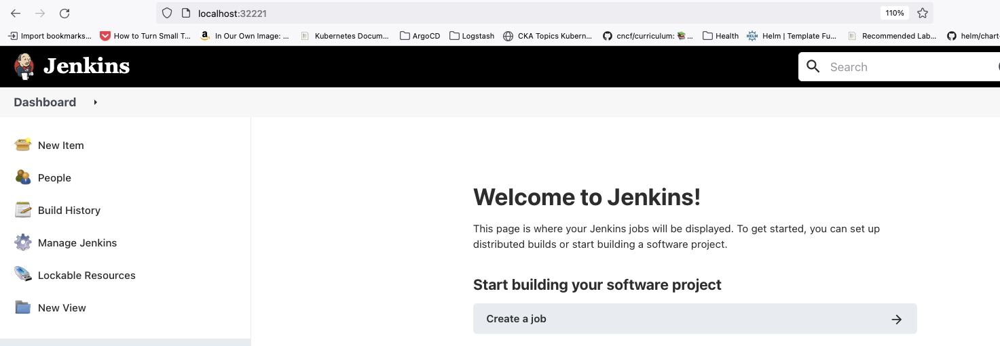

#### Define the Job
With Jenkins running, we need a job and credentials. To create the job, select the **Create a job** link in the right pane.

Provide the information and click **OK**.
- Item name: **superapp**
- Type: **Pipeline**

Fill in the information listed here, leaving all other options as default:
- Description: **CICD Demo**
- Pipeline Definition: **Pipeline script from SCM**
- SCM: **Git**
- Repository URL: **http://gitea-http:3000/superapp/superapp.git**
- Credentials:
  - Select **Add > Jenkins**
  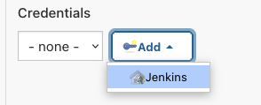
  - Provide the following information, then click the **Add** button:
    - Kind: **Username with password**
    - Scope: **Global**
    - Username: **superapp**
    - Password: **password** (or the password you defined earlier)
    - ID: **superappRepo**
    - Description: **access Gitea**
    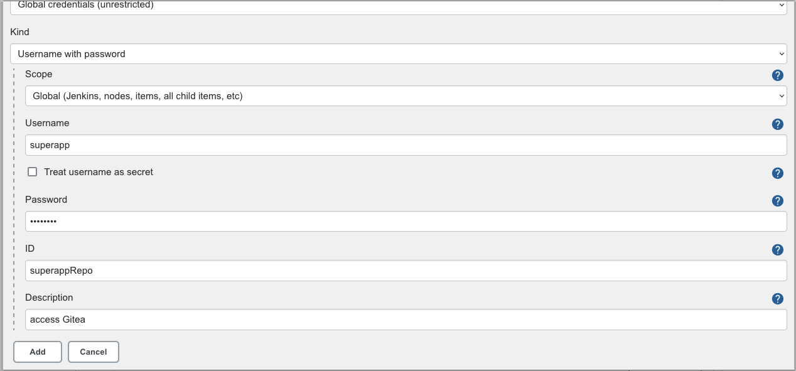
  - Script Path: **Jenkinsfile**

When finished, the job definition will appear as shown here:
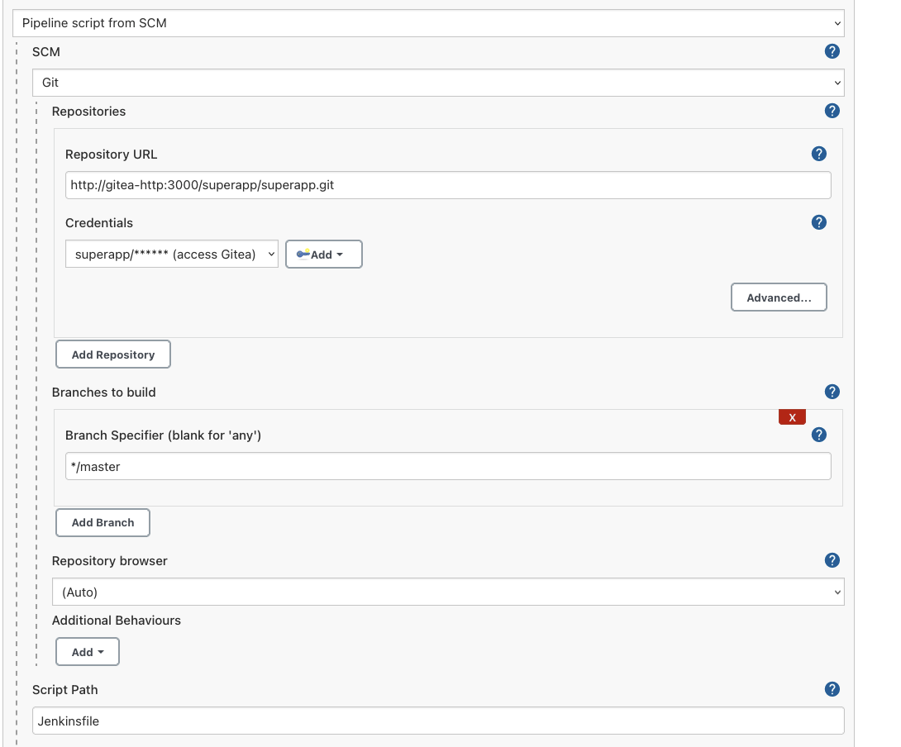

Click **Save** to save the job.

## Run the pipeline manually
The first few times you will run the pipeline manually.  The process will be automated later in this guide.

In the Jenkins console, click **Build Now** from the left panel of the superapp job:
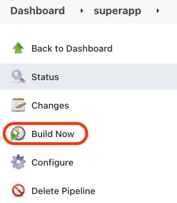

When you launch the job, there will be a lot of activity in your cluster:
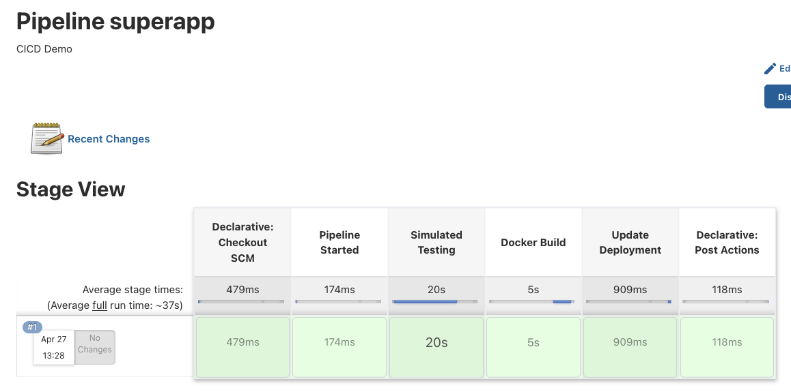

You can view the output in the console logs to see all of the activity by selecting the build from the build history:
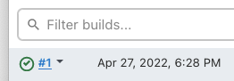

Select **Console Output**:
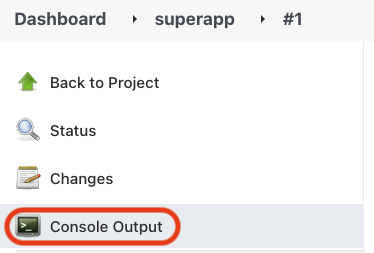
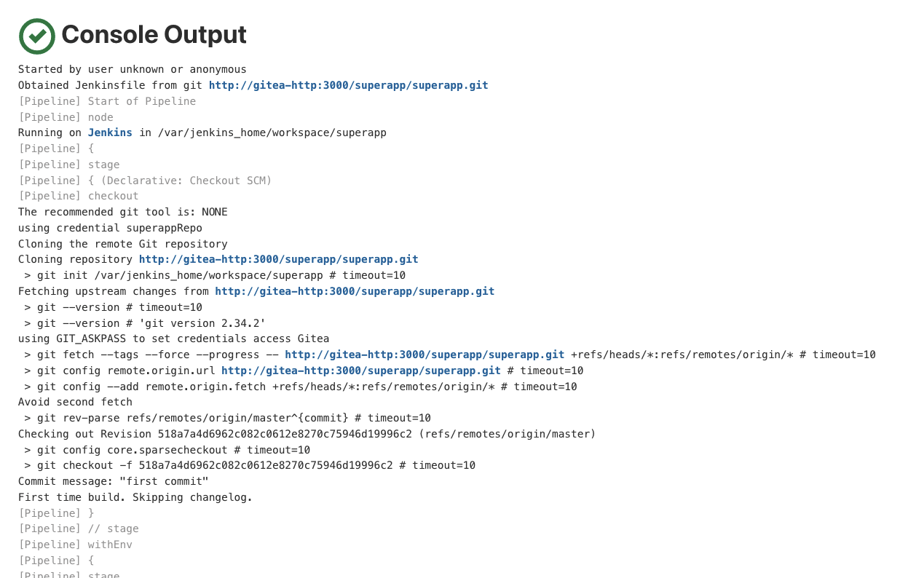

**[Sample output](cicdDemoFiles/jenkinsFiles/sampleoutput.txt)**

You can also see logs for a particular stage by clicking the stage and selecting the Logs button:
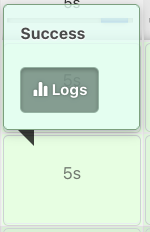

If using k9s, you can observe the new pod with the application being deployed in real-time:
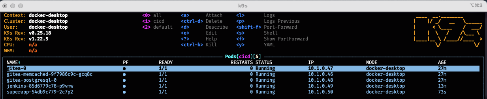

### View the application
In a new tab in your browser, navigate to http://localhost:32222/:
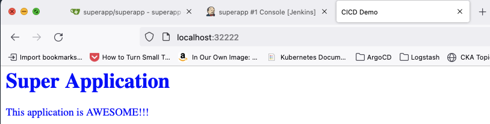

### Make changes to the application
Modify the application by making changes to the title, headers, body text or colors.  In this example, the foreground and background colors, header and body text were changed.

For ideas on colors to try, see https://www.w3schools.com/tags/ref_colornames.asp. Use the lowercase forms of the names in the file.

When finished, commit the changes to the repository:
```
### Navigate to the directory with the code
cd ${HOME}/cicd/cicdDemo

### Modify index.html.  This example output shows the file after the changes were saved
cat index.html

### Output
<html>
<head>
<title> CICD Demo </title>
</head>
<body bgcolor="yellow" text="green">

<h1> Super Application v2 </h1>

This application is even more AWESOME now!!!!

</body>
</html>

### Add file to git
git add index.html

### Commit the code
git commit -m"updating my code"

### Output from commit
[master 81a849a] updating my code
 1 file changed, 3 insertions(+), 3 deletions(-)

### Push the code
git push

### Output
Enumerating objects: 5, done.
Counting objects: 100% (5/5), done.
Delta compression using up to 12 threads
Compressing objects: 100% (3/3), done.
Writing objects: 100% (3/3), 403 bytes | 403.00 KiB/s, done.
Total 3 (delta 1), reused 0 (delta 0), pack-reused 0
remote: . Processing 1 references
remote: Processed 1 references in total
To http://localhost:32220/superapp/superapp.git
   518a7a4..81a849a  master -> master
```

In the Jenkins console, click the **Build Now** button as before.  The pipeline runs again:
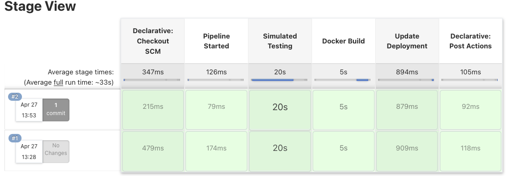

If you are observing the pods in the k9s interface, you can see the pod being replaced with the new version:
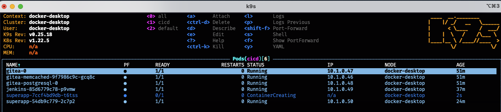

If you examine your Docker images, the new image will be listed ( **1.2** ):
```
### List the images
docker image ls | grep superapp

### Output
REPOSITORY     TAG        IMAGE ID       CREATED         SIZE
superapp       1.2        16982a0662fb   2 minutes ago    47.8MB
superapp       latest     16982a0662fb   2 minutes ago    47.8MB
superapp       1.1        d4b452e5cdc5   6 hours ago      47.8MB 
```

Refresh the browser tab for the application.  Your changes will be reflected:
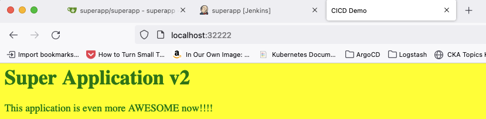

You can iterate on this process several more times, making further changes to `index.html` and observing the new code by refreshing the superapp tab in your browser after each run of the pipeline.

## Automate the process
Now that you know the pipeline is working, you can set it up for automated deployment.

Modify the **superapp** job as follows.  To modify, select the job from the main Jenkins page and click the **Configure** button in the left panel.  If necessary, you can get to the Jenkins home page by clicking the logo in the upper left corner of the console.

In the top section, configure Jenkins to discard old builds:
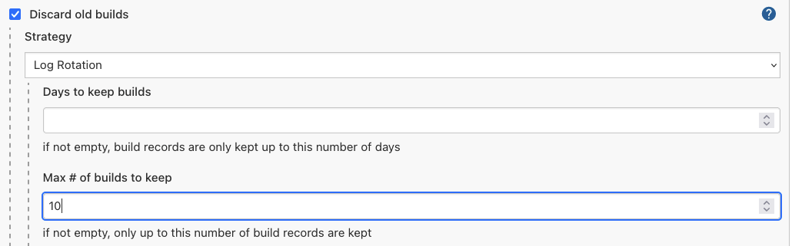

In the **Build Triggers** section, select the **Poll SCM** checkbox.  Set the schedule as **`* * * * *`**

This cron-like schedule will scan the Gitea repository for changes every minute and only run the pipeline if a change is detected.  This interval is the smallest one that is configurable in Jenkins:
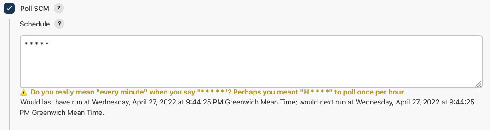

Click **Save**.

You can make changes to the index.html file as before, except now the Jenkins pipeline will pick up those changes automatically within a minute and run the pipeline.

## Summary
At this time, you have a fully operational CICD demonstration. Hopefully you have a greater understanding of CICD at this time, and you can easily show basic CICD operations using this demonstration environment.

### Tearing down the demo environment
All of the data for the repository and Jenkins configurations are now stored in volumes in Docker Desktop.  You can remove the Gitea helm application, Jenkins components and the superapp application to free up resources.  These commands will not remove the persistent data stores from your system:
```
### Delete the gitea application using helm
helm uninstall gitea

### Remove the Jenkins components
cd ~/jenkinsFiles
kubectl delete -f jenkins.yaml

### Delete the superapp deployment and service
kubectl delete deploy/superapp
kubectl delete svc/superapp-nodeport

### If the port-forward to the Gitea console is still active, stop it by pressing Ctrl+C in the terminal.
```

To restart the demo environment, you will need to run the `helm install` command for Gitea and `kubernetes deploy` for Jenkins again.

>**Note**: Ensure you have your context pointing at the cicd namespace first!
When resetting after having cleared the demo resources, you will have to run the job manually at least once to restart the superapp application.
```
### Helm install for Gitea
helm install gitea gitea-charts/gitea

### Jenkins deployment
cd ./cicdDemoFiles/jenkinsFiles
kubectl apply -f jenkins.yaml

### (optional) Reset the port-forward if you want to see the Gitea repository in the console
kubectl port-forward svc/gitea-http 32220:3000
```

If you run the `docker system prune` command and remove images, you will need to recreate the Jenkins image [as instructed above](#jenkins).  Also, if you ever run the prune command and also remove the volumes, your persistent data will be lost and you will have to go through all the steps in this guide again.  This requirement would also be the case if you reset your Docker or Kubernetes environments in the Docker Desktop application.

## Next steps
Return to the [reference pipeline](README.md) for a more sophisticated example using our products.
